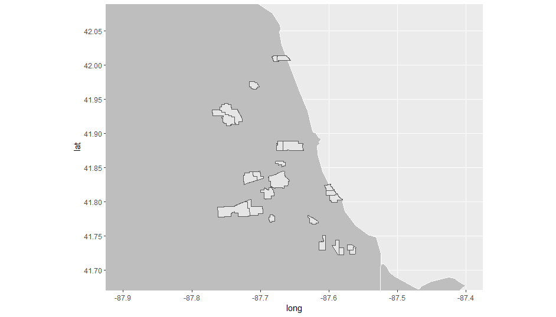

# ChicagoPublicSchools

Data Description: Attendance boundaries for middle schools in the Chicago Public Schools district for school year 2019-2020.
Dataset: https://data.world/cityofchicago/68rq-5b3g

I grabbed a random set of data and decided to see what could be done with it.  As it turned out, I picked geospatial data and got to learn about shapefiles and generating them from csv data. The part of the project that wasn't clearly defined was specifing where in the dataset the MULTIPOLYGON data was located.  wkt='the_geom' was the key!

There isn't much data to do an in-depth analysis, but the exercise of learning how to plot it on a map was well worth the time and effort.
